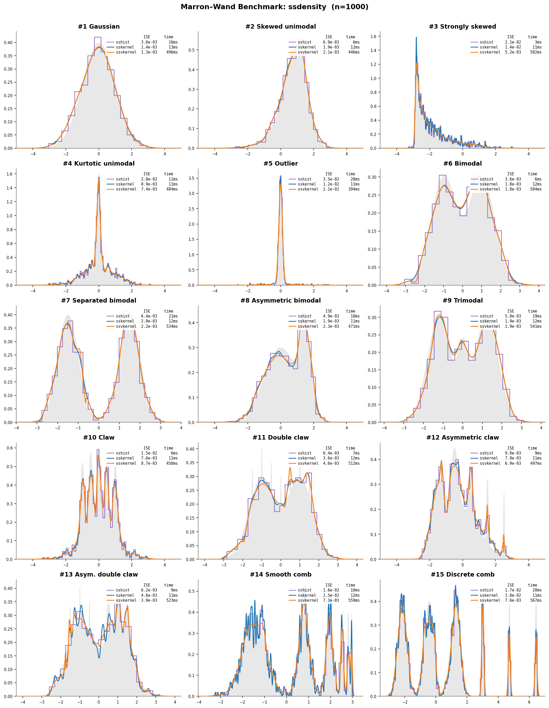
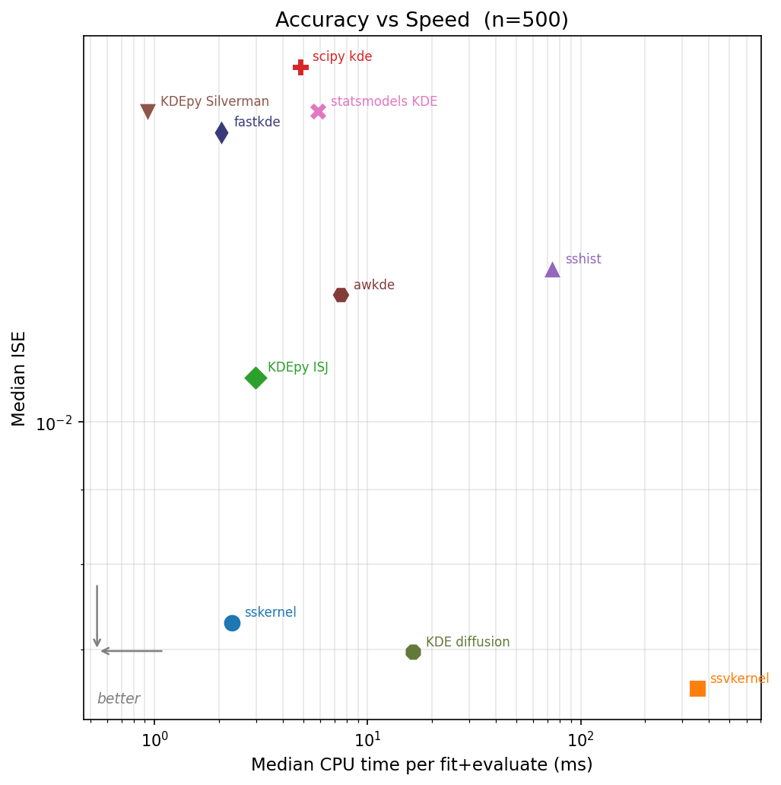
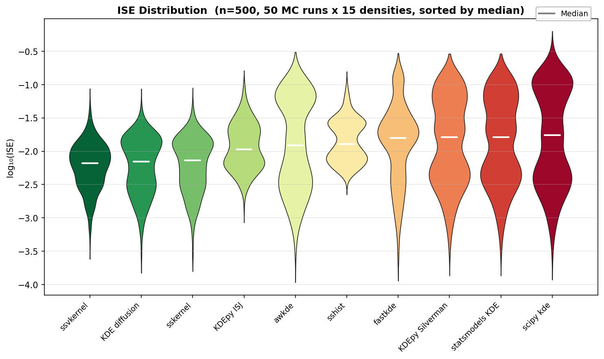

# ssdensity

Optimal histogram and fixed or locally adaptive kernel density estimation for 1-D data.

> Forked from [AdaptiveKDE](https://github.com/shimazaki/AdaptiveKDE)
> ([PyPI: adaptivekde](https://pypi.org/project/adaptivekde/)) with
> significant performance improvements. Original code is preserved
> in the `classic` subpackage.

## Installation

```
pip install ssdensity
```

Or from source:

```
pip install -e .
```

Requires Python >= 3.9 and NumPy >= 1.24.

## Quick start

```python
import numpy as np
from ssdensity import sshist, sskernel, ssvkernel

x = np.concatenate([np.random.randn(300) - 1, np.random.randn(300) + 1])

optN, optD, edges, C, N = sshist(x)
y, t, optw, W, C, confb95, yb = sskernel(x)
y, t, optw, gs, C, confb95, yb = ssvkernel(x)
```

## Methods

### 1. `sshist` -- optimal histogram bin width

Selects the number of bins *N* (equivalently, bin width
*&Delta;* = (*x*<sub>max</sub> &minus; *x*<sub>min</sub>) / *N*) by
minimizing the mean integrated squared error (MISE) between the histogram
and the unknown underlying event rate:

> *C*<sub>*n*</sub>(*&Delta;*) = (2*k&#x0304;* &minus; *v*) / *&Delta;*<sup>2</sup>

where *k&#x0304;* and *v* are the mean and (biased) variance of the
event counts across bins. See
[neuralengine.org/res/histogram](https://www.neuralengine.org/res/histogram.html)
for further information.

### 2. `sskernel` -- fixed-bandwidth kernel density estimation

Estimates a globally optimal Gaussian bandwidth *w* by minimizing the
cost function derived from the MISE (Shimazaki & Shinomoto, 2010):

> *C*(*w*) = &sum;<sub>*i,j*</sub> &int; *k*<sub>*w*</sub>(*x* &minus; *x*<sub>*i*</sub>) *k*<sub>*w*</sub>(*x* &minus; *x*<sub>*j*</sub>) d*x* &minus; 2 &sum;<sub>*i* &ne; *j*</sub> *k*<sub>*w*</sub>(*x*<sub>*i*</sub> &minus; *x*<sub>*j*</sub>)

where *k*<sub>*w*</sub> is a Gaussian kernel with bandwidth *w*. See
[neuralengine.org/res/kernel](https://www.neuralengine.org/res/kernel.html)
for further information.

### 3. `ssvkernel` -- locally adaptive kernel density estimation

Extends `sskernel` by allowing the bandwidth to vary as a function of
location. At each point, the locally optimal bandwidth is selected by
minimizing the same *L*<sub>2</sub> cost evaluated within a local window.
A stiffness parameter *&gamma;* (0 &lt; *&gamma;* &le; 1) controls the
trade-off between local adaptivity and global smoothness; it is optimized
via golden-section search. See
[neuralengine.org/res/kernel](https://www.neuralengine.org/res/kernel.html) for further information.

Each function also has a `_classic` variant that preserves the original
reference implementation with identical signatures and return values:

```python
from ssdensity import sshist_classic, sskernel_classic, ssvkernel_classic
```

The improved versions are the default and recommended for normal use.
The `_classic` variants are provided for reference and reproducibility.

## Benchmark



Comparison of all three methods on the 15 Marron-Wand densities (1000 samples
each). See `benchmarks/` for the benchmark notebook.

### MISE comparison





Median Integrated Squared Error on 15 Marron-Wand densities (n=500, 50 MC runs).
`sskernel`, `ssvkernel`, and KDE diffusion consistently rank in the top 3.
Reproduce: `python benchmarks/performance_comparison/run_mise_comparison.py`

### Speed comparison

Median CPU time on bimodal synthetic data (0.5 N(-1,1) + 0.5 N(1,1)),
Python 3.11, NumPy 2.4, 256-point evaluation grid:

| Method | n=1,000 | n=10,000 | n=100,000 |
|---|---:|---:|---:|
| **sskernel** | 1.5 ms | 1.6 ms | 4.2 ms |
| **ssvkernel** | 46.4 ms | 48.1 ms | 52.1 ms |
| **sshist** | 123.3 ms | 231.2 ms | 298.4 ms |
| np.histogram (Scott) | 0.1 ms | 0.2 ms | 1.7 ms |
| KDEpy FFTKDE (Silverman) | 0.9 ms | 0.9 ms | 2.5 ms |
| statsmodels KDE (normal ref) | 2.9 ms | 26.5 ms | 508.8 ms |
| sklearn KernelDensity (Scott) | 8.0 ms | 62.3 ms | 546.1 ms |
| scipy.gaussian_kde (Scott) | 257.0 ms | 3.07 s | 12.52 s |

`sskernel` uses data-driven MISE optimization yet runs competitively with
rule-of-thumb methods. `scipy.gaussian_kde` is notably slow because it
evaluates the full kernel sum without FFT acceleration.
sskernel/ssvkernel run with `bootstrap=0` (default, no bootstrap).
Reproduce: `python benchmarks/speed_comparison/run_speed_comparison.py`


## References

- H. Shimazaki and S. Shinomoto, "A method for selecting the bin size of
  a time histogram," *Neural Computation* 19(6): 1503-1527, 2007.
  [doi:10.1162/neco.2007.19.6.1503](https://doi.org/10.1162/neco.2007.19.6.1503)

- H. Shimazaki and S. Shinomoto, "Kernel bandwidth optimization in spike
  rate estimation," *Journal of Computational Neuroscience* 29(1-2):
  171-182, 2010.
  [doi:10.1007/s10827-009-0180-4](https://doi.org/10.1007/s10827-009-0180-4)

## Authors

- Hideaki Shimazaki (shimazaki.hideaki.8x@kyoto-u.jp) -- [shimazaki](https://github.com/shimazaki) on GitHub
- Lee A.D. Cooper (cooperle@gmail.com) -- [cooperlab](https://github.com/cooperlab) on GitHub
- Subhasis Ray (ray.subhasis@gmail.com)

## License

Apache License 2.0. See [LICENSE.txt](LICENSE.txt) for details.
