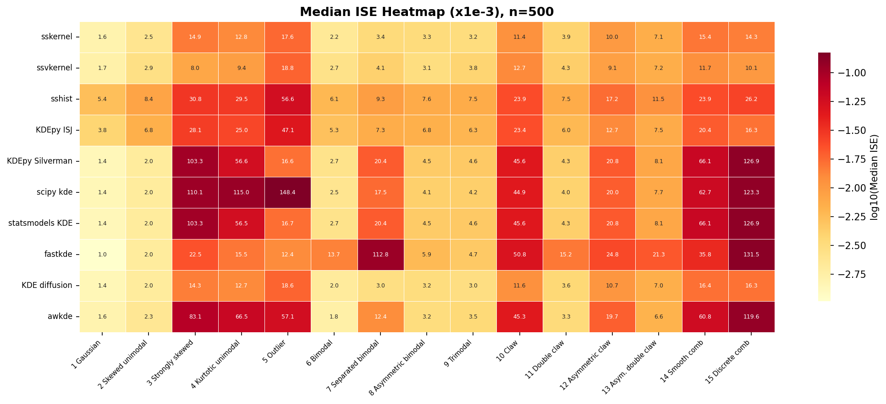

# ssdensity

Optimal histogram and fixed or locally adaptive kernel density estimation for 1-D data.

> Forked from [AdaptiveKDE](https://github.com/shimazaki/AdaptiveKDE)
> ([PyPI: adaptivekde](https://pypi.org/project/adaptivekde/)) with
> significant performance improvements. Original code is preserved
> in the `classic` subpackage.

## Installation

```
pip install ssdensity
```

Or from source:

```
pip install -e .
```

Requires Python >= 3.9 and NumPy >= 1.24.

## Quick start

```python
import numpy as np
from ssdensity import sshist, sskernel, ssvkernel

x = np.concatenate([np.random.randn(300) - 1, np.random.randn(300) + 1])

optN, optD, edges, C, N = sshist(x)
y, t, optw, W, C, confb95, yb = sskernel(x)
y, t, optw, gs, C, confb95, yb = ssvkernel(x)
```

## Methods

### 1. `sshist` -- optimal histogram bin width

Selects the number of bins *N* (equivalently, bin width
*&Delta;* = (*x*<sub>max</sub> &minus; *x*<sub>min</sub>) / *N*) by
minimizing the mean integrated squared error (MISE) between the histogram
and the unknown underlying event rate:

> *C*<sub>*n*</sub>(*&Delta;*) = (2*k&#x0304;* &minus; *v*) / *&Delta;*<sup>2</sup>

where *k&#x0304;* and *v* are the mean and (biased) variance of the
event counts across bins. See
[neuralengine.org/res/histogram](https://www.neuralengine.org/res/histogram.html)
for further information.

### 2. `sskernel` -- fixed-bandwidth kernel density estimation

Estimates a globally optimal Gaussian bandwidth *w* by minimizing the
cost function derived from the MISE (Shimazaki & Shinomoto, 2010):

> *C*(*w*) = &sum;<sub>*i,j*</sub> &int; *k*<sub>*w*</sub>(*x* &minus; *x*<sub>*i*</sub>) *k*<sub>*w*</sub>(*x* &minus; *x*<sub>*j*</sub>) d*x* &minus; 2 &sum;<sub>*i* &ne; *j*</sub> *k*<sub>*w*</sub>(*x*<sub>*i*</sub> &minus; *x*<sub>*j*</sub>)

where *k*<sub>*w*</sub> is a Gaussian kernel with bandwidth *w*. See
[neuralengine.org/res/kernel](https://www.neuralengine.org/res/kernel.html)
for further information.

### 3. `ssvkernel` -- locally adaptive kernel density estimation

Extends `sskernel` by allowing the bandwidth to vary as a function of
location. At each point, the locally optimal bandwidth is selected by
minimizing the same *L*<sub>2</sub> cost evaluated within a local window.
A stiffness parameter *&gamma;* (0 &lt; *&gamma;* &le; 1) controls the
trade-off between local adaptivity and global smoothness; it is optimized
via golden-section search. See
[neuralengine.org/res/kernel](https://www.neuralengine.org/res/kernel.html) for further information.

Each function also has a `_classic` variant that preserves the original
reference implementation with identical signatures and return values:

```python
from ssdensity import sshist_classic, sskernel_classic, ssvkernel_classic
```

The improved versions are the default and recommended for normal use.
The `_classic` variants are provided for reference and reproducibility.

## Comparison of methods

Ten density estimation methods are evaluated on the 15 Marron-Wand (1992)
benchmark densities (*n* = 500, 50 Monte Carlo runs per density).

### ISE distribution


Each violin shows the distribution of Integrated Squared Error (ISE) across
all 750 (density, run) pairs on a log10 scale. Methods are sorted left to right
by median ISE (white line); lower is better.
`ssvkernel`, KDE diffusion (Botev et al. 2010), and `sskernel` form the top
tier with the lowest medians and tightest distributions.

### MISE heatmap



Median ISE (x10^-3) for each method-density pair, sorted by pooled median ISE
(best at top). Darker cells indicate lower (better) error. The hardest
densities -- #3 Strongly skewed, #5 Outlier, #14 Smooth comb, #15 Discrete
comb -- separate methods most clearly. `sskernel`, `ssvkernel`, and KDE
diffusion maintain consistently low error across all 15 densities.

### Accuracy vs speed


Pooled median ISE (y-axis, log scale) versus mean computation time per
fit-and-evaluate call (x-axis, log scale). The left panel shows CPU time
(`time.process_time`, summed across all threads); the right panel shows wall
time (`time.perf_counter`). Points closer to the lower-left corner are both
more accurate and faster. The gap between CPU and wall time reveals implicit
multi-threading: `sskernel` and `ssvkernel` use ~100x more CPU cycles than wall
time on a multi-core machine, because NumPy's FFT (pocketfft) and BLAS
(OpenBLAS) parallelize automatically.

Reproduce: `python benchmarks/performance_comparison/run_mise_comparison.py`


## References

- H. Shimazaki and S. Shinomoto, "A method for selecting the bin size of
  a time histogram," *Neural Computation* 19(6): 1503-1527, 2007.
  [doi:10.1162/neco.2007.19.6.1503](https://doi.org/10.1162/neco.2007.19.6.1503)

  ```bibtex
  @article{shimazaki2007histogram,
    author  = {Shimazaki, Hideaki and Shinomoto, Shigeru},
    title   = {A Method for Selecting the Bin Size of a Time Histogram},
    journal = {Neural Computation},
    volume  = {19},
    number  = {6},
    pages   = {1503--1527},
    year    = {2007},
    doi     = {10.1162/neco.2007.19.6.1503}
  }
  ```

- H. Shimazaki and S. Shinomoto, "Kernel bandwidth optimization in spike
  rate estimation," *Journal of Computational Neuroscience* 29(1-2):
  171-182, 2010.
  [doi:10.1007/s10827-009-0180-4](https://doi.org/10.1007/s10827-009-0180-4)

  ```bibtex
  @article{shimazaki2010kernel,
    author  = {Shimazaki, Hideaki and Shinomoto, Shigeru},
    title   = {Kernel Bandwidth Optimization in Spike Rate Estimation},
    journal = {Journal of Computational Neuroscience},
    volume  = {29},
    number  = {1--2},
    pages   = {171--182},
    year    = {2010},
    doi     = {10.1007/s10827-009-0180-4}
  }
  ```

## Authors

- Hideaki Shimazaki (shimazaki.hideaki.8x@kyoto-u.jp) -- [shimazaki](https://github.com/shimazaki) on GitHub
- Lee A.D. Cooper (cooperle@gmail.com) -- [cooperlab](https://github.com/cooperlab) on GitHub
- Subhasis Ray (ray.subhasis@gmail.com)

## License

Apache License 2.0. See [LICENSE.txt](LICENSE.txt) for details.
